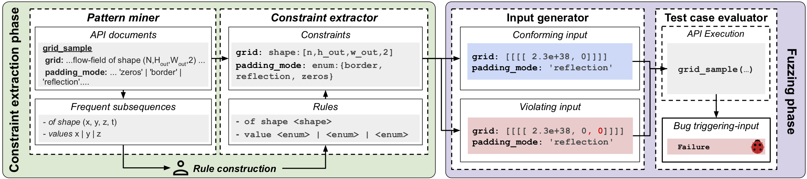

# DocTer: Documentation-Guided Fuzzing for Testing Deep Learning API Functions

## Overview
DocTer extracts constraints from API documentation to guide the generation of test inputs for DL API functions.

Here is a figure to show the overview of DocTer:

## Library Bugs

DocTer detects 46 bugs, while a baseline fuzzer without input constraints detects only 19 bugs. Most  (33)  of the 46 bugs are previously unknown. A detailed list together with triggering inputs is listed [here](https://github.com/icse-submit/materials/tree/master/libbug_list.md).

If you would like to try out the bug-triggering input, please see documentation [here](https://github.com/icse-submit/materials/tree/master/bug_trigger_inputs)

## Documentation Bugs

DocTer detects 37 documentation bugs within 51 APIs of three categories, including 26 fixed or confirmed after we  report them. Details is listed [here](https://github.com/icse-submit/materials/tree/master/docbug_list.md)

## Extracted Constraints
If you would like to checkout the extracted constraints for the library bugs DocTer found, please see documentation [here](https://github.com/icse-submit/materials/tree/master/constraints)
